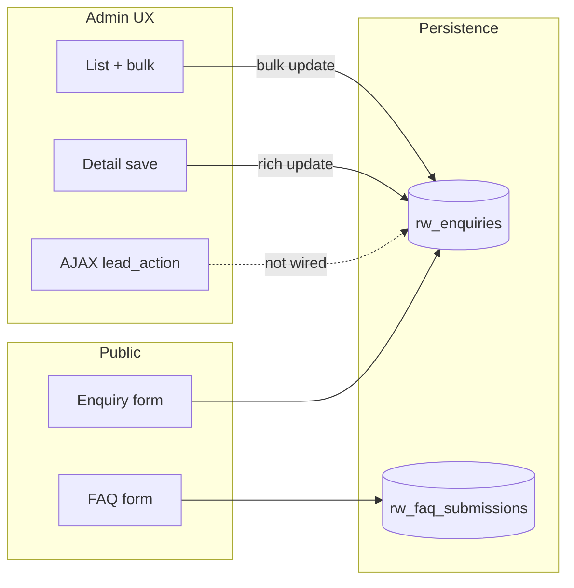

# CRM Risk Audit (Usage + Security + Operations + UX + Database + Backend architecture)

**Date:** 2026-05-09 (re-audit)  
**Revision:** 2026-05-09 — expanded **strategic / heuristic / critical** product & admin-UX assessment (dashboard affordances, process drift, maturity scoring, prioritised backlog). **2026-05-09 (b)** — **Database / SQL** pass: schema & index gaps, defensive SQLi surface, dynamic `WHERE` regression risk, `SELECT *`/N+1/`LOWER()` join notes, concurrency, P0–P2 DB backlog; skills lens extended (`sql-pro`, `sql-optimization-patterns`, `database`, defensive `sql-injection-testing` / sqlmap scope note). **2026-05-09 (c)** — **Backend architecture** pass: bounded contexts, mutation surface fragmentation, idempotency/resilience/observability gaps, integration contracts (`wp_mail`, Mailchimp), `backend-architect` lens + backlog hooks.  
**Previous audit:** 2026-05-08  
**Scope:** `inc/crm.php`, `inc/enquire-handler.php`, `inc/faq-question-handler.php`, `inc/form-notify.php`, `inc/mailchimp.php`, `inc/guest-guide.php`, `inc/enqueue.php` (admin assets), `assets/css/admin-crm.css`

## Skills lens (from `SKILLS_GLOSSARY.md`)

This pass explicitly used these glossary entries as review heuristics (not as automated tools):

| Skill (glossary slug) | How it was applied |
|------------------------|--------------------|
| `security-auditor` | Defence in depth, data exposure, admin vs public boundaries |
| `backend-security-coder` | Input validation, authz on handlers, safe persistence |
| `threat-modeling-expert` | STRIDE-style prompts: tampering (CSRF), info disclosure, repudiation gaps |
| `wordpress-penetration-testing` | Capabilities, nonces, `admin_post`, AJAX, options misuse |
| `php-pro` | Sanitisation, SQL composition, WordPress APIs vs raw queries |
| `ui-ux-pro-max` | Admin layout, hierarchy, spacing, feedback states, consistency |
| `product-manager-toolkit` | End-to-end lead flow, role clarity, gap between intent and shipped behaviour |
| `ui-skills` | Interaction patterns, empty states, table ergonomics, avoidable friction |
| `sql-pro` | Schema/index fitness, dynamic SQL composition, `$wpdb->prepare` correctness, scalability |
| `sql-optimization-patterns` | Access paths, N+1, `SELECT *`, expression indexes, pagination cost |
| `database` (workflow bundle) | Design vs implementation gaps, migrations, operational risk |
| `sql-injection-testing` / `sqlmap-database-pentesting` | **Defensive only:** threat model for injectable surfaces; **no** live exploitation or SQLMap runs (unauthorised testing is out of scope). |
| `backend-architect` | Service boundaries inside the monolith, command/query entry points, resilience (mail, webhooks), idempotency, observability, duplication of business rules across handlers |

---

## Executive summary

The CRM stack is **generally aligned with WordPress expectations**: custom capability for CRM screens, `check_admin_referer` / `wp_verify_nonce` on sensitive actions, heavy use of `$wpdb->prepare()` and allow-lists for sort columns, and public forms gated by nonce, honeypot, timing heuristics, and transient rate limits.

**Highest practical risk** remains **operational**: duplicate enquiry handling still produces duplicate outbound email, and several admin workflows (bulk status, FAQ Mailchimp, CSV export) lack parity with the “happy path” for auditability or recovery.

**Product / UX (critical read):** The enquiries **core** is visually and structurally stronger than most bespoke WordPress CRMs, but the product **violates mental models** in several measurable places (**dashboard stat tiles do not match their underlying queries or destinations**; three incompatible status-update code paths; dead AJAX). Secondary surfaces (FAQ inbox, mailing list) are **utility-grade**, not **experience-grade**. The full critique is in **§ Product, UX, streamlineability, and process architecture** below—not a compliment sandwich; it separates what is genuinely good from what will fail under staff turnover, volume, or compliance pressure.

**Database / SQL:** The **logical schema is adequate** for current features, but **`rw_enquiries` lacks secondary indexes** for the main access patterns—so scale and dashboard cost are the primary technical risk. **Prepared statements and allow-lists** are used correctly on admin filters; public writes use **`$wpdb->insert()`**. Full write-up in **§ Database architecture, SQL security, and query performance** below.

**Backend architecture:** The CRM is a **cohesive WordPress theme module** with a clear **capability** gate (`restwell_manage_enquiries`) and conventional **admin POST + PRG** flows, but **business rules for status transitions are implemented three times** (detail form, bulk loop, AJAX)—an **architectural defect** that guarantees drift. **Outbound side-effects** (`wp_mail`, Mailchimp) run **inline in the web request** with **no** shared idempotency key, queue, or structured audit trail. Detail in **§ Backend architecture: boundaries, contracts, and resilience** below.

---

## Product, UX, streamlineability, and process architecture

*This section is a strategic and heuristic evaluation of the **admin** CRM (plus how public submissions feed it). Evidence is drawn from `inc/crm.php`, `inc/faq-question-handler.php`, `inc/enqueue.php`, and `assets/css/admin-crm.css`.*

### 1. Job-to-be-done and strategic fit

**Jobs users implicitly hire this CRM for**

1. **Triage:** See what arrived, what is urgent, what is stale, what needs a call back.  
2. **Execute:** Reply, progress the deal, hand off, send guide, close loop.  
3. **Govern:** Know what was said to whom, when status changed, and who exported PII.  
4. **Coordinate:** Assign work so two people do not double-handle the same lead.

**What the build actually optimises for**

- **(1) and (2)** for the **enquiry** object: list + detail + lifecycle CTAs are clearly where effort went.  
- **(3)** is **partial**: append-only activity log and status timestamps on the *detail* path only; bulk breaks the story; exports are unaudited.  
- **(4)** is **thin**: assignee exists, “Mine” filter exists, but there is **no** collision signal, @mention, or workload view—acceptable for 1–2 operators, weak for three+.

**Strategic verdict:** Positioned correctly as a **lightweight in-theme lead desk** for a single property / small team. It is **misleading** if anyone treats it as a **process-controlled CRM** (HubSpot-grade stage rules, automation, SLA enforcement, or marketing ops). The UI *looks* closer to a product than the **process contract** underneath—which is a **reputation risk** when editors discover bulk actions “do not count” the same way as the detail screen.

---

### 2. Heuristic evaluation (Nielsen-style, applied critically)

| Heuristic | Assessment | Concrete evidence / gap |
|-----------|------------|---------------------------|
| **Visibility of system status** | **Mixed** | Success notices on save; GA4/Mailchimp badges. **Weak:** no global “last Mailchimp sync” or export log; FAQ Mailchimp failure invisible; duplicate submit still *feels* successful to the visitor (email spam) while DB dedupes silently. |
| **Match between system and real world** | **Good on enquiry detail** | Human-oriented labels for statuses; mailto/tel. **Bad:** `funding_type` shown as **raw slug** on detail (`kcc` vs “Kent County Council”)—breaks the “same language as the guest” rule. |
| **User control and freedom** | **Mixed** | Filters and sort restore some control. **Bulk status** offers speed but **no undo** and **no confirmation** of side effects—dangerous once users learn the hard way that booking emails may not fire. |
| **Consistency and standards** | **Poor (internal)** | **Three** status mutation implementations (detail POST, bulk POST, AJAX handler) with **different semantics**—this is the single largest **UX and integrity** failure: the interface does not promise which behaviour you get. |
| **Error prevention** | **Mixed** | Post-stay uses `confirm()`. **Missing:** no guard when bulk-moving many rows to `booked`; no “you are about to email N guests” for bulk (because bulk does not email—**silent omission** is worse than an error). |
| **Recognition rather than recall** | **Good** | Status pills, badges, orientation table on dashboard reduce recall of where WordPress hides content. |
| **Flexibility and efficiency of use** | **Underdelivers** | Power-user path (keyboard, inline edit, saved views) is largely absent. **AJAX handler exists** (`restwell_crm_handle_lead_action`) with **no** enqueued admin script—accelerators were started then not shipped. |
| **Aesthetic and minimalist design** | **Good on enquiries** | `admin-crm.css` scopes layout, density, and focus states for the main funnel. **Dashboard is heavy:** orientation table + settings + stats on one scroll competes for attention; not minimal, **comprehensive**—fine for onboarding, fatiguing for daily return visits. |
| **Help users recognise, diagnose, recover from errors** | **Weak on spokes** | FAQ inbox explains notify failure in prose but offers **no** row action to “resend” or “copy question.” |

---

### 3. Critical finding: dashboard metrics vs navigation (broken affordance)

The dashboard stat tiles are **clickable** (`<a class="rw-stat-tile">`), which **promises** “this number is a lens into that cohort.” Several tiles **do not honour that contract**:

1. **“Urgent & uncontacted”** — The SQL behind the count is effectively **urgent + status `new`**, but the tile’s `href` uses **`status_filter=new` only** (see `restwell_crm_dashboard_page()` tile config). That list includes **non-urgent** new leads. **Result:** staff click expecting the urgent queue and get a broader list—**trust erosion** in the highest-stakes metric.

2. **“Follow-ups overdue”** — The count uses `follow_up_at` relative to “now” and excludes `closed`, but the link is the **generic enquiries URL** with **no** `follow_up_due` (or equivalent) filter. **Result:** the number on the tile is **not reconcilable** without manual scanning—defeats the purpose of a operational dashboard.

3. **“New this week”** — The SQL counts **all** enquiries with `submitted_at` in the last seven days **regardless of status**, but the tile links to **`status_filter=new`**. **Result:** the headline number can include contacted/qualified/booked/closed leads from the last week, while the destination list hides them—**another broken affordance** (arguably worse than the urgent tile because “this week” sounds time-based, not pipeline-based).

4. **“Total enquiries”** — Count and destination are both “all records”; this tile **does** match its affordance and should be treated as the **control** when regression-testing others.

**Severity:** **P1 (UX / operations)** — not a security bug, but it systematically **wastes time** and teaches users to **distrust** the dashboard as a source of truth.

---

### 4. Process architecture: intended pipeline vs implementation drift

**Analysis:** The **canonical** transition logic (timestamps, notes, booking confirmation email) lives on the **detail** path and on **AJAX**—but **not** on **bulk**. Bulk is therefore not a “faster detail”; it is a **different product** wearing the same skin. That is **architecturally dishonest** to the user.

**Process maturity rating (honest scale)**

| Dimension | Score | Rationale |
|-----------|-------|-----------|
| **Lead capture → inbox** | 4/5 | Forms + CRM row + notifications are solid. |
| **Inbox → qualification** | 3/5 | List/detail good; SLA badge only for `new`; urgent row styling helps. |
| **Qualification → booking** | 3/5 | Booking email on first `booked` **if** detail path used; bulk undermines. |
| **Booking → fulfilment** | 4/5 | Guest Guide handoff is a standout, with prefill URLs. |
| **Closed loop / marketing** | 2/5 | Mailing list is read-only; Mailchimp partial; FAQ sync silent on failure. |
| **Governance / audit** | 2/5 | Activity log good on detail path; export and bulk weaken the story. |

---

### 5. Streamlineability (task analysis, critical)

**Fast paths that genuinely work**

- Open enquiry from list → **Reply by Email** / **tel** → set status + follow-up → **Save** → back to list: **few clicks**, clear layout, good **motor** efficiency (primary button full width).

**Friction that compounds under load**

- **Reconciliation tax:** User must remember that **dashboard numbers ≠ list filters** (see §3).  
- **Mode-switching tax:** Staff notes (editable blob) vs activity log (append-only) is cognitively correct for power users but **undocumented**—new hire risk.  
- **Tool-switching tax:** No “copy entire enquiry to clipboard” or “open in Gmail compose with body”—mailto is fine but **primitive** for long threads.  
- **Governance tax:** CSV export is one click from full PII with **no** trace—discourages healthy use in regulated contexts.

**Dead investment:** `restwell_crm_handle_lead_action` + JSON success payloads (`updated_status_html`, `sla_html`) imply a **list-inline** interaction model was planned. Shipping the handler **without** `wp_enqueue_script` + `wp_localize_script` is **worse than not building it**: future maintainers assume inline edits exist; users get nothing.

---

### 6. Backend UI craft (visual and interaction quality)

**Where the UI is genuinely strong**

- **Scoped design system:** `.restwell-admin` + dedicated CSS avoids polluting global wp-admin; focus/hover on pills and sort links is intentional (`admin-crm.css`).  
- **Enquiries table:** Column plan matches **how leads are scanned** (flags → identity → contact → marketing → dates → owner → status → time). That is **professional information design**, not accidental.  
- **Detail layout:** Main/sidebar split mirrors **read vs act**—reduces accidental edits to immutable submission content.

**Where the UI is weak or uneven**

- **Tier-B screens:** FAQ inbox and mailing list use **default WordPress table chrome** with minimal Restwell styling—users **feel** they left the product.  
- **Dashboard density:** Orientation table is valuable **once**; on every visit it **competes** with operational widgets. Consider collapse-by-default or a separate “Editor handbook” admin page.  
- **Pagination UX:** Page numbers are rendered as a row of buttons (`for` loop)—works, but **no** “prev/next”, **no** total on every page state when `total_pages > 1` only shows count in tablenav—minor inconsistency.

---

### 7. Usability: edge cases and honesty of feedback

- **Funding slug** on detail: fails **content parity** with what the guest saw on the form (labels exist in `restwell_enquiry_funding_label()` in `enquire-handler.php` but are **not reused** in CRM detail).  
- **FAQ visitor messaging:** When email fails but DB succeeds, the visitor can still get a **success-shaped** redirect; staff see **Notify: No**. The system is honest internally but **asymmetric externally**—consider a softer third state (“Received—if you do not hear from us…”).  
- **Accessibility:** Screen-reader labels exist in many places; **select-all** checkbox does not expose relationship to row checkboxes (`aria-controls` / `aria-label` on master checkbox could be improved). Using `confirm()` for post-stay is accessible but **crude** compared to WP dialog patterns.

---

### 8. Consolidated backlog (UX / process), prioritised

| Priority | Item | Rationale |
|----------|------|-----------|
| **P0** | **Unify status transitions** in one code path; bulk must call it | Eliminates silent divergence (customer emails, timestamps, notes). |
| **P0** | **Fix dashboard tile URLs** to match each tile’s SQL (new-this-week cohort; urgent+new; follow-ups due) | Restores trust in metrics—several tiles are **actively misleading** today. |
| **P1** | **Remove or ship** `restwell_lead_action` AJAX (enqueue JS + nonce) | Stops dead code; if shipped, improves streamlineability. |
| **P1** | **Duplicate submit → suppress duplicate emails** | Aligns visitor + staff perception with DB truth. |
| **P2** | FAQ inbox: pagination, full-question view, Mailchimp failure column, optional “handled” | Brings spoke up toward enquiries quality bar. |
| **P2** | Reuse funding (and similar) **labels** on enquiry detail | Cheap win for credibility. |
| **P2** | Export audit trail + optional `manage_options` for export | Matches governance expectations as PII volume grows. |
| **P3** | Dashboard orientation: collapsible / separate doc page | Reduces daily noise for experienced users. |
| **P3** | Settings split (site vs CRM) when team >2 | Reduces cognitive scope per screen. |

---

### 9. Closing assessment (no hedging)

The Restwell CRM **front-loads quality** into the enquiry list and detail experience and **back-loads debt** into bulk actions, dashboard navigation fidelity, secondary tables, and orphaned AJAX. For a **founder-led** operation it is **good enough to ship**; for an **operation that scales staff or volume** it will generate **silent mistakes** (wrong customer emails, wrong timestamps, unexplained metrics) unless the **P0** items are fixed. The build is **not** “rough everywhere”—it is **polished in the centre and hollow at the spokes**, which is a **specific** architectural pattern that this audit treats as **technical debt with UX symptoms**, not as cosmetic polish.

---

## Database architecture, SQL security, and query performance

*Lens: `sql-pro`, `sql-optimization-patterns`, `database` workflow; injection analysis framed using `sql-injection-testing` methodology **without** executing attacks or SQLMap (defensive review only).*

### 1. Schema and indexing (strategic)

**Tables** (`restwell_crm_maybe_create_table()` in `inc/crm.php`): `rw_enquiries`, `rw_enquiry_notes`, `rw_guests`, `rw_faq_submissions` — created via `dbDelta()` with sane varchar lengths and `PRIMARY KEY (id)`.

**Critical gap — `rw_enquiries` secondary indexes**

- Today the enquiries table defines **only** `PRIMARY KEY (id)`. There are **no** indexes on columns heavily used in predicates and sorts:
  - Duplicate guard: `email` + `submitted_at`
  - List / counts: `status`, `assigned_to`, `submitted_at`, combined filters
  - Dashboard: `submitted_at`, `is_urgent` + `status`, `follow_up_at` + `status`
- **Effect:** at low volume MySQL may still be “fast enough”; at thousands of rows, duplicate detection, dashboard aggregates, and filtered list queries become **full-table scans**. This is the main **sql-pro / optimisation** finding: the **logical model supports the product**, but the **physical model does not yet support the access patterns**.

**Positive**

- `rw_enquiry_notes`: `KEY (enquiry_id)` — supports note fetch by enquiry.  
- `rw_faq_submissions`: `KEY (submitted_at)`, `KEY (email)` — supports inbox ordering and opt-in union.  
- `rw_guests`: `KEY (email)` — supports lookups (see also performance caveat below on `LOWER()`).

**Recommendations (index strategy)**

- Add composite/partial indexes aligned to real queries, e.g. `(status, submitted_at)`, `(email, submitted_at)`, `(follow_up_at, status)`, and/or `(is_urgent, status)` — validate with `EXPLAIN` on staging with realistic row counts (per `sql-pro` / `sql-optimization-patterns`).

---

### 2. SQL injection surface (defensive assessment)

**Attack premise for SQLMap-style tools:** unauthenticated HTTP parameters must reach **string-concatenated** SQL. In this CRM:

- **Admin list/filters** (`status_filter`, `owner_filter`, `s`, `orderby`, `order`): `status_filter` / `orderby` are constrained to **allow-lists** (`array_key_exists` / `in_array`); `order` is normalised to `ASC`/`DESC` only; search uses `sanitize_text_field` + `$wpdb->esc_like()` + **`$wpdb->prepare()`** for LIKE clauses. **No** classic injection vector identified on these inputs **as currently written**.
- **Dynamic `WHERE` + `prepare` tail:** `$where` is built from literals `1=1` and **fragments returned by `$wpdb->prepare()`** (each fragment embeds its own placeholders). The final query uses `prepare(..., $per_page, $offset)` only for `LIMIT`/`OFFSET`. This is a **valid WordPress pattern** *if* every fragment remains prepared—**regression risk** is high if a future edit appends raw `$_GET` into `$where`.
- **Identifiers:** `ORDER BY {$orderby} {$order}` uses **whitelist-only** identifiers — correct (never pass user strings as column names through `prepare`; it does not escape identifiers).

**Public forms → CRM writes:** `restwell_crm_save_enquiry` / `restwell_faq_save_submission` use **`$wpdb->insert()`** with typed format arrays — **parameterised inserts**, not concatenated SQL from POST bodies. **No** first-order SQLi on public submission paths identified.

**Static admin queries:** CSV export and several dashboard queries use **fully static** SQL with only **table name** interpolation from `$wpdb->prefix` + constants — not user-controlled.

**Residual classes (not “SQLi” but data integrity)**

- One-time `UPDATE … WHERE staff_notes LIKE '%Marketing updates consent: Yes%'` during migration: not injectable, but **string matching on free text** is brittle for compliance-grade migrations.

**sqlmap / pentest note:** Running SQLMap or injection payloads against a host **without explicit written authorisation** is excluded. For a formal test, scope admin URLs, authenticate, and re-run under a controlled engagement; expect **low yield** on list filters given current sanitisation—value is in **regression** and **plugin/theme conflicts**, not in proving the obvious.

---

### 3. Query performance and patterns (`sql-optimization-patterns`)

| Pattern | Location | Assessment |
|---------|----------|--------------|
| **`SELECT *`** | Export CSV, mailing list UNION, some dashboards, guest dispatch | Wastes I/O and memory at scale; prefer explicit column lists for hot paths and exports. |
| **N+1** | Enquiries list: `get_userdata( (int) $row->assigned_to )` per row | Extra round-trips; batch-load assignees or join `wp_users` if list volume grows. |
| **`LOWER(g.email) = LOWER(e.email)`** | Booked-without-guide join | Correct for case-insensitive match; **prevents simple index use** on email — consider **persisted normalised email** (e.g. generated column or app-normalised key) if this query becomes hot. |
| **Mailing list `GROUP BY email` + `GROUP_CONCAT`** | `restwell_crm_mailing_list_page()` | Fine for small opt-in sets; on MySQL watch `group_concat_max_len` and sort memory for large cohorts. |
| **FAQ inbox `LIMIT 100`** | `inc/faq-question-handler.php` | Caps work queue visibility; not SQLi—**operational** risk (see UX section). |
| **Dashboard stat queries** | Multiple `COUNT(*)` per load | Acceptable at small N; with indexes, single pass / materialised counters could reduce load if wp-admin feels slow. |

---

### 4. Transactions, consistency, and concurrency

- Public **save → email** flows are **not** wrapped in DB transactions spanning `wp_mail` (correctly: email should not hold a DB lock). **Implication:** CRM row can exist while email fails — already partially handled with FAQ inbox / notes elsewhere; **acceptable** trade-off.
- **Duplicate guard** is **read then insert** without transaction isolation: two concurrent submits could theoretically race; unlikely at current scale, **document** if hardening is required.

---

### 5. Data lifecycle, privacy, and compliance (database angle)

- **PII concentration:** `rw_enquiries` and `rw_faq_submissions` hold names, emails, phones, health-adjacent text — backups and exports must be treated as **sensitive datasets** (row-level audit for exports already noted in risk section).
- **No row-level security in MySQL** — authorisation is entirely **application-layer** (`restwell_crm_can_manage()`, `manage_options` for some actions). Appropriate for WordPress; **wrong capability assignment** equals full table access.

---

### 6. Database backlog (prioritised, complements §8 UX backlog)

| Priority | Item |
|----------|------|
| **P0** | Add secondary indexes on `rw_enquiries` matching filter/dashboard/dup-check queries; verify with `EXPLAIN`. |
| **P1** | Replace hot-path `SELECT *` with column lists; reduce N+1 on assignee resolution in list. |
| **P1** | Document or enforce “only prepared fragments in `$where`” for enquiries list (code comment + review checklist). |
| **P2** | Revisit `LOWER()` join strategy if booked-without-guide query shows up in slow log. |
| **P2** | Consider DB transaction + idempotency key for duplicate submit **if** race conditions become real. |

---

## Backend architecture: boundaries, contracts, and resilience

*Lens: `backend-architect` — how the CRM behaves as a **system** (not only as UI or SQL): where responsibilities live, how commands enter, what guarantees exist under failure, and what will break first when load or team size grows.*

### 1. System context and bounded contexts

**In scope (this theme)**

- **Enquiry CRM** (`inc/crm.php`): custom tables, admin screens, notes, CSV export, mailing-list aggregation, dashboard metrics.  
- **Public intake** (`inc/enquire-handler.php`, `inc/faq-question-handler.php`): validation → `restwell_crm_save_enquiry()` / FAQ persistence → email + optional Mailchimp.  
- **Guest Guide** (`inc/guest-guide.php`): separate lifecycle (guests table, scheduled dispatch, own `admin_post_*` handlers) — **sibling** bounded context, not nested under enquiries UI, but shares theme and admin styling.

**External dependencies**

- **MySQL** via `$wpdb` (authoritative state).  
- **`wp_mail`** (best-effort, no delivery guarantee in core).  
- **Mailchimp** (`inc/mailchimp.php`) — synchronous HTTP from the request path when opted in.

**Architectural stance:** This is a **modular monolith** inside WordPress — appropriate for the product’s scale — but **without** an internal “application service” layer: PHP functions and hooks **are** the architecture. That is fine until **the same invariant** (e.g. “transition to `booked` always implies X”) is enforced in **multiple places**; then the lack of a **single command path** becomes the dominant backend risk.

---

### 2. Command surface (how mutations enter)

| Entry mechanism | Examples | Notes |
|-------------------|----------|--------|
| **Inline handler in screen callback** | `restwell_crm_enquiries_page()`: detail POST (`restwell_crm_action` nonce), bulk POST (`restwell_crm_bulk`) | Same function renders list **and** executes side effects — classic WordPress pattern; **hard to unit-test** and easy to extend incorrectly. |
| **`admin_post_*`** | `restwell_crm_export_csv`, `restwell_crm_add_note`, `restwell_crm_send_post_stay`, `restwell_save_settings` | Clear, bookmarkable actions; good **CSRF** story via `check_admin_referer`. |
| **`wp_ajax_restwell_lead_action`** | `restwell_crm_handle_lead_action()` | Implements `set_status` + `add_note` with timestamps and booking email in line with **detail** path — but **no admin script** is enqueued in `inc/enqueue.php` (CSS only for CRM screens). **Dead capability** from a product perspective; **live attack surface** from a security posture perspective (authenticated CRM users only). |

**Verdict:** The **intended** primary command model is **POST + redirect**; AJAX is **orphaned infrastructure**. Backend-wise, that is **worse than removing it**: it signals an unfinished second channel that will tempt future edits to “just add one more branch” instead of consolidating.

---

### 3. The core architectural flaw: fragmented status contract

Three code paths can change `rw_enquiries.status`:

1. **Detail form** (`restwell_crm_enquiries_page` first branch): updates status, assignment, follow-up, `staff_notes`, **first-touch timestamps** (`contacted_at`, `qualified_at`, `booked_at`, `closed_at`), **activity notes**, and **booking confirmation email** on first transition to `booked`.  
2. **Bulk form** (second branch): **`$wpdb->update` status only** — no timestamps, no notes, no booking email.  
3. **AJAX** (`restwell_crm_handle_lead_action`): mirrors **much** of the detail path (timestamps, notes, booking email) but **does not** replace detail assignment/follow-up/staff_notes flows.

**Why this matters architecturally**

- There is **no single “ApplyEnquiryTransition”** (or equivalent) **use case** — the **domain rule** “what does it mean to become `booked`?” is **not a contract**, it is **copy-pasted behaviour**.  
- Any new side effect (e.g. Slack, GA4 server event, deposit invoice) must be wired **N times** or will silently attach only to one path — **high defect rate** as the product evolves.  
- **Repudiation / audit:** operations staff cannot assume the activity log reflects reality after bulk moves.

**Remediation direction (architecture, not cosmetic)**

- Introduce one internal function, e.g. `restwell_crm_apply_status_change( $id, $new_status, $context )`, called from **one** POST handler and optionally from AJAX after enqueue — **bulk** either calls it per id or is disabled until it does.

---

### 4. Idempotency, deduplication, and out-of-band work

- **Duplicate enquiry window** (`restwell_crm_save_enquiry`): dedupe by email + time — **application-level** idempotency for *writes*, but **enquire-handler** still sends mail as if every submit were unique (**cross-module contract violation** between “save” and “notify”).  
- **No request / idempotency keys** on public POST: double network submit or aggressive double-click can still stress mail paths even when DB collapses to one row.  
- **Mailchimp + `wp_mail`:** executed **synchronously** in the HTTP worker. Under slow SMTP or API latency, **admin and visitor requests block**; under failure, behaviour is **inconsistent** (enquiry path logs CRM note on Mailchimp failure; FAQ path historically silent — see Medium items).  
- **No queue abstraction** (Action Scheduler, custom table + cron, etc.): acceptable for tiny volume; **fragile** for campaigns or traffic spikes.

---

### 5. Authorization model (backend view)

- **CRM screens and most mutations:** `restwell_crm_can_manage()` → `restwell_manage_enquiries`, assignable via role checkboxes in settings — **good** least-privilege story for a bespoke CRM.  
- **Risk:** any code path that uses **`manage_options` only** for CRM-adjacent data without also checking the CRM cap would **bypass** the intended operator model — worth grep audits when adding features.  
- **Guest Guide** uses its own handlers with `manage_options` in places — **intentional** if only super-admins manage guests; **document** if editors are expected to operate CRM but not guests (or vice versa).

---

### 6. Observability and operability

- **No structured application logs** (correlation id per enquiry, timing of Mailchimp, mail failures): debugging production issues relies on **host logs** and **guesswork**.  
- **CSV export:** powerful for GDPR/data portability; **no audit event** (“user U exported at T”) — governance gap noted elsewhere; architecturally it is an **untracked high-risk command**.  
- **Health:** no lightweight “CRM self-check” (DB version option vs constant, table existence, last migration) exposed to admins beyond implicit behaviour.

---

### 7. Data and integration contracts (summary)

| Contract | Current shape | Risk |
|----------|-----------------|------|
| **Enquiry row ↔ emails** | Implicit: handler assumes save outcome maps 1:1 to sends | Duplicate mails, missing mails on partial failure |
| **CRM ↔ Mailchimp** | Optional sync; errors handled unevenly by source | Data drift vs marketing audience |
| **Status ↔ timestamps ↔ notes** | Only guaranteed on detail + AJAX paths | Bulk breaks analytics and trust |

---

### 8. Backend maturity scorecard (honest)

| Dimension | Score (1–5) | Comment |
|-----------|-------------|---------|
| **Boundary clarity** | 4 | Theme module + tables + cap are clear. |
| **Command consistency** | 2 | Three status implementations — **critical** debt. |
| **Resilience / async** | 2 | Inline mail/API; no retry or queue story. |
| **Idempotency** | 2 | DB partial dedupe; email path not aligned. |
| **Observability** | 2 | No first-class ops hooks for CRM actions. |
| **Testability** | 2 | Logic embedded in large screen functions. |

---

### 9. Backend-focused backlog (aligns with existing P0–P2 items)

| Priority | Architectural action |
|----------|----------------------|
| **P0** | **Unify status mutation** behind one internal use case; make bulk either delegate or show explicit “limited bulk” warning until it does. |
| **P0** | **Remove or ship** `wp_ajax_restwell_lead_action` + enqueue JS + nonce localize — eliminate dead second channel. |
| **P1** | **Align save → notify contract:** return duplicate flag from save; handler skips duplicate outbound messages. |
| **P1** | **Export audit:** log user id + timestamp + row count (options table or small `rw_crm_audit` table). |
| **P2** | **Optional:** queue non-critical mail/Mailchimp via Action Scheduler; unify FAQ vs enquiry failure handling at the **integration** boundary. |
| **P2** | Extract **thin service functions** (save, transition, export) from page renderers to improve testability without rewriting WordPress. |

---

## Critical / High

### 1) Duplicate enquiry suppression still sends duplicate emails

**Status:** Unchanged since prior audit.

**Where**

- `restwell_crm_save_enquiry()` in `inc/crm.php` (returns existing `id` when same email within 30 minutes)
- `restwell_handle_enquire_submit()` in `inc/enquire-handler.php` (staff + acknowledgement mail after save)

**Risk**

- Same person double-submitting within the window: one DB row, **multiple** staff notifications and user ack emails → noise and trust issues.

**Remediation**

- Return structured save metadata (`id`, `is_duplicate`) from save (or a dedicated duplicate probe), and **skip** staff/ack sends when duplicate; optionally append a CRM note “duplicate submit suppressed”.

---

### 2) Duplicate guard is email-only within 30 minutes

**Status:** Unchanged.

**Where**

- `restwell_crm_save_enquiry()` duplicate `SELECT` uses `email` + `submitted_at` window only.

**Risk**

- Legitimate second enquiry from the same address (different message/dates) can be folded into the first row; staff miss material changes.

**Remediation**

- Stronger fingerprint (e.g. hash of normalised message + date range + guest count) with tunable window, or “link as follow-up” instead of silent reuse.

---

## Medium

### 3) Bulk status updates bypass lifecycle timestamps and activity notes

**Status:** Unchanged.

**Where**

- `restwell_crm_enquiries_page()` bulk branch: direct `$wpdb->update( ..., 'status' => $bulk_action )` per id (`inc/crm.php`).

**Risk**

- `contacted_at`, `qualified_at`, `booked_at`, `closed_at` not set in bulk path; no auto note like the single-detail form; reporting and **booking confirmation email** (`restwell_email_booking_confirmed`) only fire on the rich single-update path, not bulk.

**Remediation**

- Reuse the same transition helper used by the detail form for each id (or a shared internal function).

---

### 4) FAQ marketing opt-in: Mailchimp failure is silent

**Status:** Unchanged.

**Where**

- `inc/faq-question-handler.php` — `restwell_mailchimp_upsert_marketing_contact()` return value ignored.

**Contrast**

- `inc/enquire-handler.php` adds a CRM note when Mailchimp fails after marketing opt-in.

**Remediation**

- Persist failure on `rw_faq_submissions` (e.g. `marketing_sync_failed` + timestamp) and surface in CRM / mailing list tooling.

---

### 5) Settings: several fields cannot be cleared from the UI

**Status:** Unchanged.

**Where**

- `restwell_crm_handle_save_settings()` in `inc/crm.php` — `restwell_enquiry_notify_email`, `restwell_phone_number`, `restwell_property_address`, `restwell_property_postcode` only call `update_option` when non-empty.

**Risk**

- Stale contact details remain after “clear the field and save”.

**Remediation**

- Always persist sanitised values (including empty), or explicit “clear” controls per field.

---

### 6) Rate limiting: IP-only bucket

**Status:** Unchanged.

**Where**

- `restwell_form_rate_limit_exceeded()` in `inc/form-notify.php` (`REMOTE_ADDR` + transient).

**Risk**

- Shared egress IPs blocked together; distributed abuse evades cap.

**Remediation**

- Multi-signal throttles (e.g. IP + email hash + UA) with graduated responses.

---

### 7) CSV export: strong auth, no export audit trail

**Status:** Partially reassessed — **auth is sound**.

**Where**

- `restwell_crm_handle_export_csv()` — `restwell_crm_can_manage()` + `check_admin_referer( 'restwell_crm_export_csv' )` (`inc/crm.php`).

**Remaining gap**

- No log of *who* exported *when*; any role with `restwell_manage_enquiries` can exfiltrate full PII with no forensic trail.

**Remediation**

- Log user ID + time to an append-only option, custom table, or CRM note stream; consider `export` vs `view` capability split.

---

## Low

### 8) FAQ inbox capped at 100 rows

**Status:** Unchanged (`LIMIT 100` in `restwell_faq_inbox_page()`).

---

### 9) Unauthorised dashboard vs mailing-list behaviour differs

**Where**

- `restwell_crm_dashboard_page()` returns early without `wp_die` if `! restwell_crm_can_manage()`.
- `restwell_crm_mailing_list_page()` uses `wp_die` for the same case.

**Risk**

- Direct URL probe by a user without cap: dashboard callback may render an **empty** admin experience rather than an explicit denial (menu is still hidden by capability, so severity is low).

---

### 10) Open redirect surface on enquiry form (low, conditional)

**Where**

- `enq_redirect` in `inc/enquire-handler.php` passed through `esc_url_raw()`.

**Risk**

- If an attacker could alter the posted redirect (e.g. via another vuln), user could be sent off-site after submit. Mitigation already relies on same-origin form + nonce.

---

### 11) Marketing consent filters (UX / ops)

**Status:** Prior audit noted list/detail visibility improvements; optional filter chips on enquiry list remain a nice-to-have.

---

## Security posture (positive findings)

- **Capability model:** `restwell_manage_enquiries` gates menu, list, detail POST handling, export, notes, AJAX lead actions; settings use `manage_options`.
- **CSRF:** Admin POST handlers use `check_admin_referer` or nonce verify; AJAX uses `check_ajax_referer`; public forms use `wp_verify_nonce`.
- **SQL:** User-controlled list filters and search go through `prepare` / `esc_like`; `orderby` / `order` are allow-listed (`submitted_at`, `status`, `name` + `ASC`/`DESC` only).
- **Public forms:** Nonce, honeypot, timing check, rate limit, sanitised redirects for FAQ flash.
- **Mailchimp:** Outbound API uses `wp_remote_request`, Basic auth with API key; failures logged when `WP_DEBUG`.

---

## Quick fix priority (suggested order)

1. Stop duplicate emails when duplicate enquiry row is reused.  
2. Tighten duplicate detection fingerprint.  
3. Unify bulk status transitions with single-enquiry transition logic (timestamps, notes, booking email policy).  
4. Track / surface Mailchimp failures for FAQ opt-ins.  
5. Allow clearing notify email / phone / address / postcode from settings.  
6. (Optional) Export audit log + softer multi-signal rate limits.

---

## Suggested acceptance tests

- Same enquiry twice within 30 minutes → one CRM row, **one** staff email, **one** ack.  
- Same email, materially different payload within 30 minutes → second row **or** explicit “linked follow-up” UX.  
- Bulk set to `contacted` → `contacted_at` set and activity note present.  
- FAQ opt-in with forced Mailchimp failure → visible failure state for retry.  
- Clear notify email in settings → stored empty and fallback/default behaviour documented.  
- User without `restwell_manage_enquiries` → cannot `admin_post` export CSV (403 / die) and cannot load enquiry UI meaningfully.
